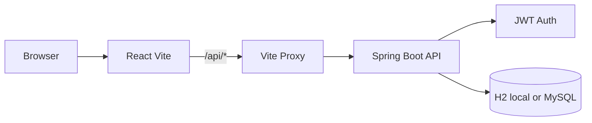
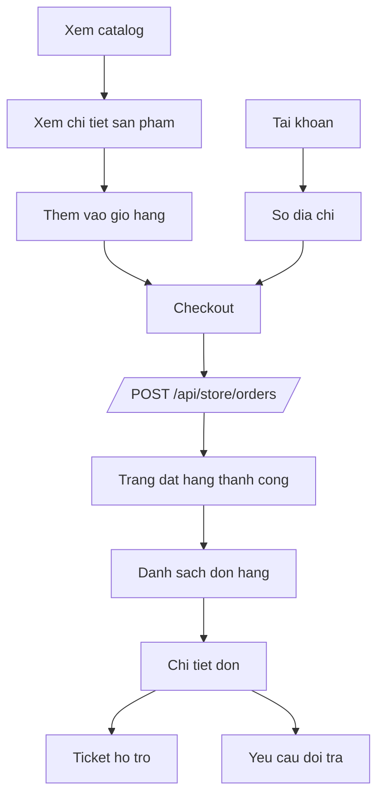
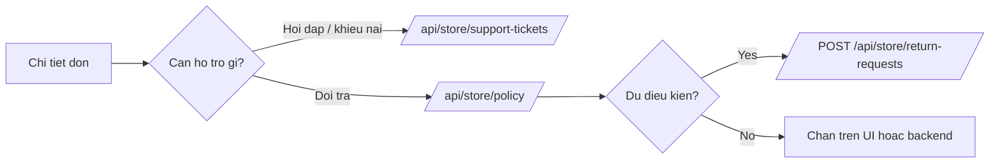
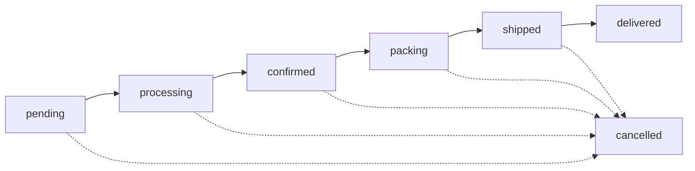
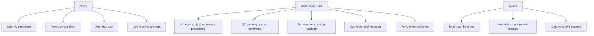

# Architecture And Flow

Tai lieu nay mo ta flow cua repo hien tai theo code dang co trong `frontend-react` va `backend-java`.
Muc tieu la tach ro:

- flow dang chay that qua API va database
- flow demo/mock chi luu tren trinh duyet
- phan con thieu neu muon web "kin" hon

## 1. Tong quan he thong

- Frontend: `frontend-react` (Vite + React + React Query + Zustand)
- Backend: `backend-java` (Spring Boot + JWT + JPA)
- API local: `http://localhost:8080`
- Frontend local: `http://localhost:5173`
- DB local mac dinh: H2 qua profile `local`



## 2. Flow route va phan quyen

Cum route chinh:

- Public store: `/`, `/nu`, `/nam`, `/phu-kien`, `/sale`, `/san-pham/:slug`, `/lookbook`
- Customer: `/gio-hang`, `/thanh-toan`, `/don-hang`, `/tai-khoan`, `/ho-tro`, `/ho-tro/yeu-cau`, `/tai-khoan/dia-chi`
- Seller workspace: `/seller/*`
- Staff workspace: `/staff/*`
- Admin workspace: `/admin/*`

```mermaid
flowchart TD
    Guest[Khach vang lai] --> Public[Public Store]
    Guest --> Login[Dang nhap / Dang ky]

    Login --> Me[/GET /api/user/]
    Me --> Role{Role}

    Role -->|user| Customer[Customer cluster]
    Role -->|seller| Seller[Seller cluster]
    Role -->|warehouse or styles| Staff[Staff cluster]
    Role -->|admin| Admin[Admin cluster]

    Customer --> C1[/tai-khoan]
    Customer --> C2[/don-hang]
    Customer --> C3[/ho-tro]

    Seller --> S1[/seller/san-pham]
    Seller --> S2[/seller/don-hang]
    Seller --> S3[/seller/bao-cao]

    Staff --> W1[/staff/orders]
    Staff --> W2[/staff/qc-packing]
    Staff --> W3[/staff/shipments]
    Staff --> W4[/staff/tickets returns status]

    Admin --> A1[/admin]
    Admin --> A2[/admin/orders]
    Admin --> A3[/admin/users staff reports]
```

Luu y:

- Role `styles` duoc normalize thanh `warehouse`
- `SellerRoute` hien cho phep `admin`, `seller`, `warehouse`
- `StaffRoute` hien cho phep `admin`, `warehouse`
- `AdminRoute` chi cho `admin`

## 3. Flow customer dang chay that

Phan customer hien da noi API that kha day du:

- catalog
- cart
- checkout
- order history
- order detail
- address book
- support ticket
- return request



### Rule customer hien tai

- Checkout co the lay dia chi tu `user-addresses`
- Neu tick luu lai dia chi, frontend se them vao so dia chi, khong ghi de dia chi mac dinh cu
- Return request chi mo cho:
  - don `delivered`
  - con trong `maxRefundDays`
  - chua co return request truoc do



## 4. Flow van hanh don hang

Chuoi trang thai dang dung o backend:

`pending -> processing -> confirmed -> packing -> shipped -> delivered`

Nhanh huy:

`pending|processing|confirmed|packing|shipped -> cancelled`



### Mapping theo vai tro



## 5. Phan nao la flow that, phan nao la flow demo

### Flow that qua backend

- Customer store, cart, checkout, orders, support ticket, return request, address book
- Seller profile co ban cua shop: `storeName`, `storeDescription`, `storePhone`, `storeAddress`, `storeLogoUrl`
- Seller catalog va order listing
- Staff cap nhat order status that
- Admin overview va mot so du lieu tong hop backend

### Flow demo hoac chi luu tren trinh duyet

- Admin demo mode mac dinh dang `OFF`, chi bat khi `VITE_ADMIN_DEMO_MODE=true`
- Staff QC state, draft van chuyen, waybill va timeline log dang luu trong `staffDemo.ts` qua `localStorage`
- Seller ratings page dang mo phong feedback tu aggregate rating, reply/note/flag chi luu local
- Seller bank settings, notify settings va doi mat khau trong profile seller dang la local/demo
- Mot so block admin orders, refunds, logs van dung du lieu minh hoa

## 6. Web con thieu gi

Day la cac mat xich con thieu neu muon web khong chi "chay demo" ma con kin flow hon:

1. Admin backend that cho toan bo workspace
- Admin co the bat `demo mode` khi can trinh dien UI ma khong ghi xuong backend.
- Thieu persist that cho:
  - order intervention o man admin
  - refund queue that
  - audit log that
  - user flag / mot so tac vu van hanh

2. Staff logistics persist that
- QC checklist, note dong goi, draft shipping, waybill, timeline log hien dang o `localStorage`.
- Sau khi doi may / doi trinh duyet se mat.
- Flow hien moi "day du tren UI", chua day du tren backend.

3. Seller feedback module that
- Man `SellerRatingsPage` hien dang suy ra feedback tu `averageRating` va `ratingCount`.
- Chua co bang review / reply seller that cho man nay.

4. Seller account settings that
- Ho so shop co phan core da noi backend.
- Nhung 3 phan nay chua noi that:
  - tai khoan ngan hang nhan tien
  - cai dat thong bao seller
  - doi mat khau seller

5. Thanh toan chuyen khoan chua co doi soat tu dong
- Hien customer co QR va thong tin chuyen khoan.
- Xac nhan thanh toan van la flow thu cong qua action noi bo.
- Chua co webhook / reconciliation tu dong tu cong thanh toan hoac ngan hang.

## 7. Uu tien neu muon lam kin web

Thu tu hop ly de lam tiep:

1. Persist staff logistics xuong backend
- waybill
- QC note
- timeline internal log

2. Tat demo mode cho admin bang backend that
- orders
- refunds
- logs
- user moderation

3. Noi that seller profile phan con lai
- bank info
- notification settings
- change password

4. Thay seller ratings demo bang review/reply that

5. Neu can muc production hon, them payment webhook cho bank transfer

## 8. File nen mo khi debug flow

- Route map: `frontend-react/src/App.tsx`
- API client: `frontend-react/src/services/api.ts`
- Customer support / returns: `frontend-react/src/pages/CustomerSupportRequestsPage.tsx`
- Checkout: `frontend-react/src/pages/CheckoutPage.tsx`
- Address book: `frontend-react/src/pages/AddressBookPage.tsx`
- Staff local demo state: `frontend-react/src/services/staffDemo.ts`
- Admin demo mode: `frontend-react/src/services/adminDemo.ts`
- Backend order flow: `backend-java/src/main/java/com/wealthwallet/service/OrderService.java`
- Backend return flow: `backend-java/src/main/java/com/wealthwallet/service/ReturnRequestService.java`
