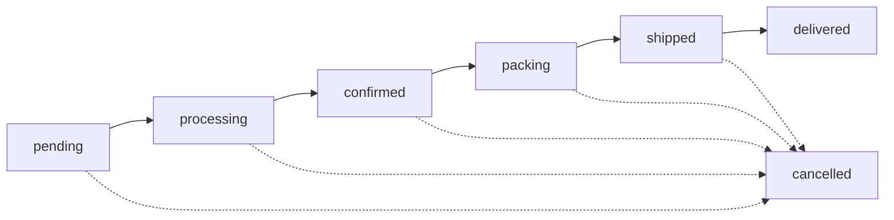
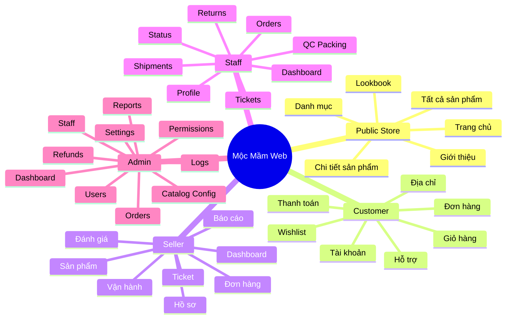

# Flow Web Hiện Tại

Tài liệu này mô tả luồng sử dụng web theo code đang chạy trong:

- Frontend: `frontend-react`
- Backend: `backend-java`
- Router chính: `frontend-react/src/App.tsx`
- Route guard: `frontend-react/src/components/layout/*Route.tsx`

Mục tiêu của file này là giúp nhìn nhanh:

- người dùng đi qua web như thế nào
- mỗi role vào khu nào
- luồng mua hàng đi từ catalog đến đơn hàng ra sao
- admin, seller, staff đang thao tác ở đâu

## 1) Flow tổng thể

```mermaid
flowchart TD
    A[Người dùng mở web] --> B[/]
    B --> C{Đã đăng nhập chưa?}

    C -->|Chưa| D[Khách vãng lai]
    C -->|Rồi| E[Lấy profile qua /api/user/me]

    D --> F[Trang chủ / catalog / lookbook / chi tiết sản phẩm]
    D --> G[/login hoặc /register]
    D --> H[Muốn mua hàng]
    H --> G

    E --> I{Role runtime}
    I -->|user| J[Customer flow]
    I -->|seller| K[Seller workspace]
    I -->|warehouse| L[Staff workspace]
    I -->|admin| M[Admin workspace]
```

## 2) Flow public store

Đây là phần ai cũng xem được mà không cần đăng nhập:

- `/`: trang chủ
- `/san-pham`: toàn bộ catalog
- `/nu`, `/nam`, `/phu-kien`, `/sale`: danh mục
- `/san-pham/:slug`: chi tiết sản phẩm
- `/lookbook`, `/lookbook/:id`
- `/gioi-thieu`

```mermaid
flowchart LR
    Home[Trang chủ /] --> Search[Tìm kiếm]
    Home --> AllProducts[/san-pham]
    Home --> Category[/nu /nam /phu-kien /sale]
    Home --> Lookbook[/lookbook]

    Search --> AllProducts
    Category --> Product[/san-pham/:slug]
    AllProducts --> Product
    Lookbook --> LookbookDetail[/lookbook/:id]

    Product --> Login[/login]
    Product --> Register[/register]
```

## 3) Flow customer mua hàng

Phần này yêu cầu đăng nhập và role phải là `USER`.

```mermaid
flowchart TD
    Login[Đăng nhập / đăng ký] --> Store[Storefront / catalog]
    Store --> Product[Chi tiết sản phẩm]
    Product --> Cart[Thêm vào giỏ hàng]
    Cart --> Checkout[Thanh toán]
    Checkout --> CreateOrder[/POST /api/store/orders]
    CreateOrder --> Success[/dat-hang-thanh-cong]
    Success --> Orders[/don-hang]
    Orders --> OrderDetail[/don-hang/:id]

    Store --> Wishlist[/yeu-thich]
    Store --> Account[/tai-khoan]
    Account --> AddressBook[/tai-khoan/dia-chi]
    AddressBook --> Checkout

    OrderDetail --> SupportChat[/ho-tro]
    OrderDetail --> SupportRequest[/ho-tro/yeu-cau]
    OrderDetail --> ReturnRequest[Yêu cầu đổi trả]
```

### Nhánh hỗ trợ và đổi trả

```mermaid
flowchart LR
    OrderDetail[Chi tiết đơn] --> Need{Khách cần gì?}
    Need -->|Hỏi đáp / khiếu nại| Ticket[/api/store/support-tickets]
    Need -->|Đổi trả| Policy[/api/store/policy]
    Policy --> Eligible{Đủ điều kiện?}
    Eligible -->|Có| Return[/POST /api/store/return-requests]
    Eligible -->|Không| Reject[Chặn ở UI hoặc backend]
```

## 4) Flow seller workspace

`SellerRoute` hiện cho phép:

- `seller`
- `admin`
- `warehouse`

Nghĩa là seller là actor chính, nhưng admin/staff vẫn có thể đi vào một số màn seller để phối hợp vận hành.

```mermaid
flowchart TD
    SellerLogin[Seller đăng nhập] --> SellerHome[/seller]
    SellerHome --> ProductMgmt[/seller/san-pham]
    SellerHome --> SellerOrders[/seller/don-hang]
    SellerHome --> SellerReports[/seller/bao-cao]
    SellerHome --> SellerRatings[/seller/danh-gia]
    SellerHome --> SellerOps[/seller/van-hanh]
    SellerHome --> SellerProfile[/seller/ho-so]
    SellerHome --> SellerTickets[/seller/tickets]

    ProductMgmt --> VariantMgmt[Tạo / sửa sản phẩm và biến thể]
    SellerOrders --> OrderFollow[Theo dõi đơn theo shop]
    SellerOps --> OpsSupport[Tương tác vận hành]
```

## 5) Flow staff workspace

`StaffRoute` hiện cho phép:

- `warehouse`
- `admin`

Role legacy `styles` được normalize về `warehouse`.

```mermaid
flowchart TD
    StaffLogin[Staff đăng nhập] --> StaffHome[/staff]
    StaffHome --> StaffOrders[/staff/orders]
    StaffHome --> QC[/staff/qc-packing]
    StaffHome --> Shipment[/staff/shipments]
    StaffHome --> Tickets[/staff/tickets]
    StaffHome --> Returns[/staff/returns]
    StaffHome --> StatusTimeline[/staff/status]
    StaffHome --> StaffProfile[/staff/profile]

    StaffOrders --> Confirm[Xử lý đơn nội bộ]
    QC --> Pack[QC và đóng gói]
    Shipment --> Waybill[Tạo / theo dõi vận đơn]
    Tickets --> Support[Giải quyết ticket]
    Returns --> RefundFlow[Xử lý đổi trả]
    StatusTimeline --> Tracking[Cập nhật timeline trạng thái]
```

## 6) Flow admin workspace

`AdminRoute` chỉ cho phép:

- `admin`

```mermaid
flowchart TD
    AdminLogin[Admin đăng nhập] --> AdminHome[/admin]
    AdminHome --> Users[/admin/users]
    AdminHome --> Staff[/admin/staff]
    AdminHome --> Permissions[/admin/permissions]
    AdminHome --> CatalogConfig[/admin/catalog-config]
    AdminHome --> Orders[/admin/orders]
    AdminHome --> Reports[/admin/reports]
    AdminHome --> Refunds[/admin/refunds]
    AdminHome --> Logs[/admin/logs]
    AdminHome --> Settings[/admin/account]

    CatalogConfig --> SystemConfig[Cấu hình catalog và hệ thống]
    Orders --> MonitorOrders[Giám sát đơn hàng]
    Refunds --> RefundQueue[Theo dõi hoàn tiền]
    Reports --> BI[Theo dõi số liệu]
```

## 7) Route guard decision

```mermaid
flowchart TD
    Route[Vào một route] --> Protected{Có ProtectedRoute?}
    Protected -->|Không| Public[Render ngay]
    Protected -->|Có| Auth{Đã đăng nhập?}
    Auth -->|Chưa| Login[/login]
    Auth -->|Rồi| Guard{Guard theo role?}

    Guard -->|Không| Render[Render page]
    Guard -->|CustomerRoute| UserOnly{role = user?}
    Guard -->|SellerRoute| SellerAccess{admin/seller/warehouse?}
    Guard -->|StaffRoute| StaffAccess{admin/warehouse?}
    Guard -->|AdminRoute| AdminOnly{role = admin?}

    UserOnly -->|Có| Render
    UserOnly -->|Không| Account[/tai-khoan]

    SellerAccess -->|Có| Render
    SellerAccess -->|Không| Home[/]

    StaffAccess -->|Có| Render
    StaffAccess -->|Không| SellerHome[/seller]

    AdminOnly -->|Có| Render
    AdminOnly -->|Không| Home
```

## 8) Luồng trạng thái đơn hàng

Backend hiện dùng chuỗi trạng thái chính:

```text
pending -> processing -> confirmed -> packing -> shipped -> delivered
```

Nhánh huỷ:

```text
pending|processing|confirmed|packing|shipped -> cancelled
```



## 9) Bản đồ web ngắn gọn



## 10) Ghi chú hiện trạng

- Route public và role flow trong tài liệu này bám theo `frontend-react/src/App.tsx`.
- `SellerRoute` đang rộng hơn tên gọi, vì cho phép cả `admin` và `warehouse`.
- `CustomerRoute` khóa chặt về `user`.
- `ProtectedRoute` chỉ kiểm tra đăng nhập; phân quyền chi tiết đi ở lớp guard sau đó.
- Flow kỹ thuật backend, proxy, JWT và DB vẫn xem thêm ở [ARCHITECTURE.md](../ARCHITECTURE.md).
